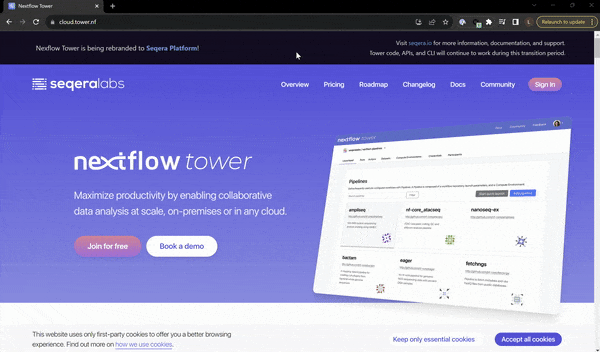
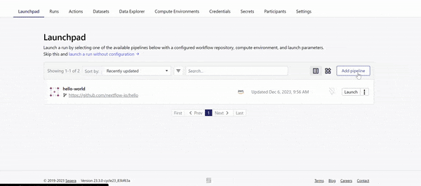
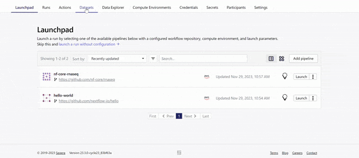
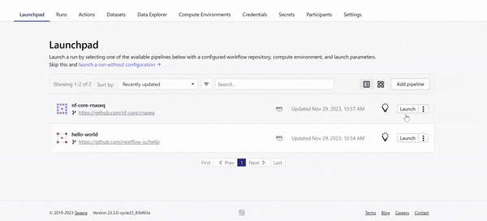
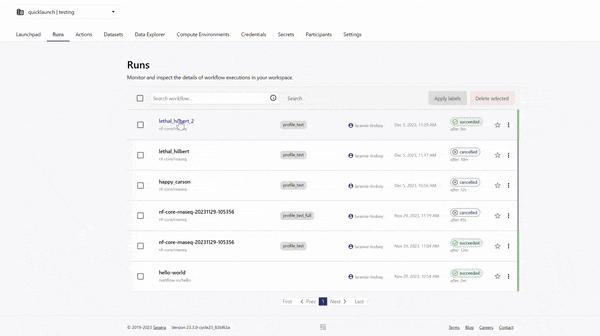
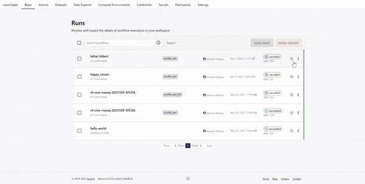
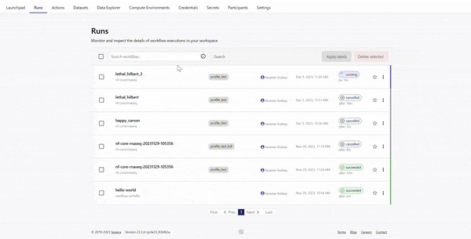

# seqeralabs/showcase Demo

This guide provides a walkthrough of the Seqera Platform demonstration. The demonstration will describe how to add a pipeline to the Launchpad, launch a workflow with pipeline parameters, monitor a run, and examine the run details.

More specifically, this demonstration will focus on using the [nf-core/rnaseq](https://github.com/nf-core/rnaseq) pipeline on AWS Batch.


## Requirements
* AWS Compute Environment
* [nf-core/rnaseq](https://github.com/nf-core/rnaseq)
* Dataset added for minimal test RNAseq data (see [samplesheet_test.csv](/samplesheet_test.csv) file)


## Overview

1. Add a Pipeline to the Launchpad
2. Add a Dataset to Seqera Platform
3. Launch your Pipeline
4. Monitor your workflow
5. Examine the run details
6. Optimize your Pipeline


## Walkthrough of demonstration


### 1. Login to seqera.io

Log into Seqera Platform, either through a GitHub account, Google account, or an email address.



### 2. Navigate into the seqeralabs/showcase Workspace

All resources in Seqera Platform live inside a workspace, which in turn belong to an organisation. Typically, teams of colleagues or collaborators will share one or more workspaces. All resources in a workspace are shared by members of that workspace.

Navigate into the `seqeralabs/showcase` Workspace.


### 3. Add a pipeline to the Launchpad
The Launchpad allows you to set up Nextflow pipelines and compute for bioinformatics to be able to execute.

Click on the 'Add Pipeline' button to add the [nf-core/rnaseq](https://github.com/nf-core/rnaseq) pipeline to the Launchpad.



Specify a name, description, and click on pre-existing AWS compute environment to execute on.

In the repository URL, specify the nf-core/rnaseq repository:
```bash
https://github.com/nf-core/rnaseq
```

Additionally, specify a version of the pipeline as the 'Revision number'. You can use `3.12.0`.

Pipeline parameters and Nextflow configuration settings can also be specified as you add the pipeline to the Launchpad.

### 4. Add a Dataset
Most bioinformatics pipelines will require an input of some sort, typically a samplesheet that encodes information about the input data to be processed. 

When running pipelines on the Cloud, this samplesheet has to be made available in Cloud storage or a remote location. Instead of doing this, we can upload a samplesheet we have locally, as a Dataset to the Platform to specify as input to our pipeline.

Go to the 'Datasets' tab and click 'Add Dataset'.



Specify a name for the dataset such as 'nf-core-rnaseq-test-dataset', description, include the first row as header, and upload the CSV file provided in this repository. This CSV file specifies the paths to 7 small FASTQ files for a sub-sampled Yeast dataset. 

### 5. Launch the nf-core/rnaseq pipeline
Navigate back to the Launchpad and click on the 'Launch' button for the newly added nf-core/rnaseq pipeline.



You will be brought to a form to specify Pipeline Parameters. For the 'input' parameter, click on the text box and click on the name of the dataset added in the previous step. 

Additionally, specify a path to a cloud storage bucket where the output of your pipelines will be saved as the 'outdir' parameter.

Finally, click 'Launch'.

### 6. View the Runs
Upon launching, you'll be navigated to the 'Runs' tab which contains all executed workflows. Click on the workflow executed in the previous step.

As the pipeline begins to run, you will see the Runs page become populated with the following details:

- Command-line invocation for the Run
- Parameters specified to the pipeline
- Resolved Nextflow configuration
- Execution Log
- Datasets used, and Reports generated



Wait until the pipeline suceeds or proceed to click on a Run that has completed successfully already.

### 7. View Run info
On the Runs page will be General information about who executed the run, when, the Git hash used and tag, as well as additional details about the compute environment used, and the version of Nextflow.


### 8. View Reports
Once the pipeline completes, you can view the outputs of the pipeline in the 'Reports' tab.

For example, for the nf-core/rnaseq pipeline, you can view the MultiQC report generated.


### 9. View details for a Task
Scroll down the Runs page and you will see:

- The progress of each Process in the pipeline
- Aggregated stats for the Run (i.e. total walltime, CPU hours)
- Workflow metrics (i.e. CPU efficiency, memory efficiency)
- Task details table for every task in the workflow

By clicking on any task, you will be shown the command run, resource usage statistics, and the task log.


### 10. Resuming a Run
If a Run fails, or is Cancelled, you can click on the three dots next to the Run to 'Resume' the workflow execution.



### 11. Task Status and Cached Processes
The Runs page for a workflow will display the status of tasks in real time as they progress from 'Submitted' to 'Running' to 'Succeeded' or 'Failed'.

If you are resuming a run that had tasks that were completed successfully, you will see a number of tasks shown as 'Cached'. 



### 12. Optimize the Pipeline
When a run completes successfully, an optimized profile is created. This profile consists of Nextflow configuration settings for each process and each resource directive (where applicable): cpus, memory, and time. The optimized setting for a given process and resource directive is based on the maximum use of that resource across all tasks in that process.

Navigate back to the Launchpad, click on the nf-core/rnaseq Pipeline added, and click on the 'Lightbulb' icon to view the optimized profile.


**Congratulations!**
You just added a pipeline to the Launchpad, and executed it on Seqera Platform! 🚀