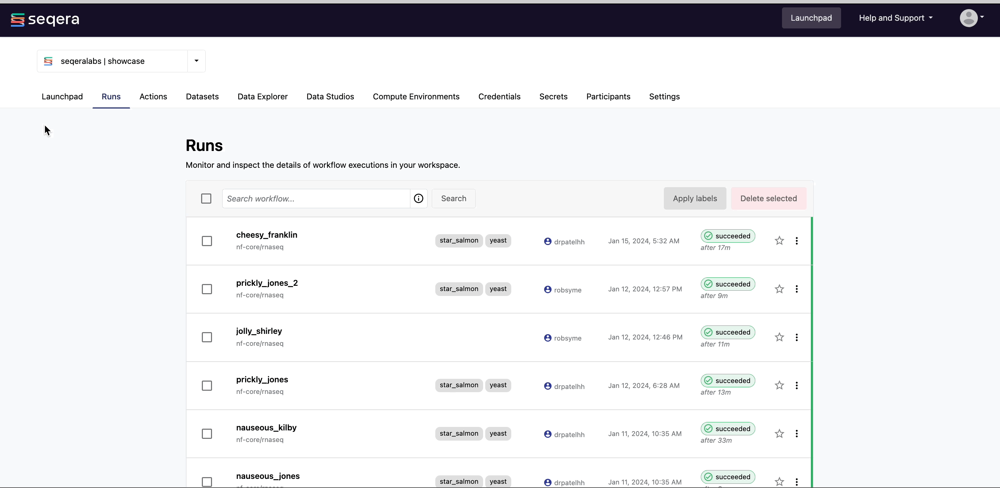
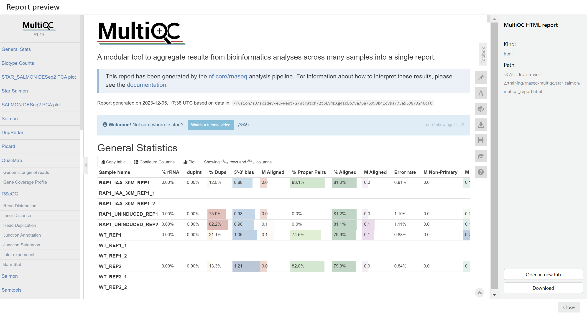

# seqeralabs/showcase Demo

This guide provides a walkthrough of a standard Seqera Platform demonstration. The demonstration will describe how to add a pipeline to the Launchpad, launch a workflow with pipeline parameters, monitor a run, and examine the run details.

More specifically, this demonstration will focus on using the [nf-core/rnaseq](https://github.com/nf-core/rnaseq) pipeline as an example and executing the workflow on AWS Batch.

## Requirements

- An [AWS Batch Compute Environment created on the Platform](https://docs.seqera.io/platform/23.3.0/compute-envs/aws-batch)
- The [nf-core/rnaseq](https://github.com/nf-core/rnaseq) pipeline repository
- Samplesheet to create a Dataset on the Platform used to run minimal test RNAseq data (see [samplesheet_test.csv](./samplesheet_test.csv) file in this repository)

## Overview

1. Add a Pipeline to the Launchpad
2. Add a Dataset to Seqera Platform
3. Launch your Pipeline
4. Monitor your workflow
5. Examine the run details
6. Example the task details
7. Optimize your Pipeline
8. View pipeline results in Data Explorer

## Walkthrough of demonstration

### 1. Login to seqera.io

Log into Seqera Platform, either through a GitHub account, Google account, or an email address.

If an email address is provided, Seqera Cloud will send an authentication link to the email address to login with.


### 2. Navigate into the seqeralabs/showcase Workspace

All resources in Seqera Platform live inside a Workspace, which in turn belong to an Organisation. Typically, teams of colleagues or collaborators will share one or more workspaces. All resources in a Workspace (i.e. pipelines, compute environments, datasets) are shared by members of that workspace.

Navigate into the `seqeralabs/showcase` Workspace.


### 3. Add a Pipeline to the Launchpad

The Launchpad allows you to launch and manage Nextflow pipelines and associated compute that your pipelines will be executed on. Using the Launchpad, you can create a curated set of pipelines (including variations of the same pipeline) that are ready to be executed on the associated compute environments, while allowing the user to customize the pipeline-level parameters if needed.

### 3a. Add a Pipeline

To add a pipeline, click on the **'Add Pipeline'** button. As an example, we will add the [nf-core/rnaseq](https://github.com/nf-core/rnaseq) pipeline to the Launchpad.


Specify a name, description, and click on pre-existing AWS compute environment to execute on.

### 3b. Specify a repository URL and revision

In the repository URL, specify the nf-core/rnaseq repository:

```bash
https://github.com/nf-core/rnaseq
```

Additionally, specify a version of the pipeline as the 'Revision number'. You can use `3.12.0`.

### 3c. Parameters and Nextflow Configuration

Pipeline parameters and Nextflow configuration settings can also be specified as you add the pipeline to the Launchpad.

For example, a pipeline can be pre-populated to run with specific parameters on the Launchpad.


### 3d. Pre-run script and additional options

You can run custom code either before or after the execution of the Nextflow script. These text fields allow you to enter shell commands.

Pre-run scripts are executed in the nf-launch script prior to invoking Nextflow processes. Pre-run scripts are useful for executor setup (e.g., use a specific version of Nextflow) and troubleshooting.


### 4. Add a Dataset

Most bioinformatics pipelines will require an input of some sort, typically a samplesheet where each row consists of a sample, the location of files for that sample (such as fastq files), and other sample details.

Datasets in Seqera Platform are CSV (comma-separated values) and TSV (tab-separated values) files stored in a workspace. They are used as inputs to pipelines to simplify data management, minimize user data-input errors, and facilitate reproducible workflows.

When running pipelines on the Cloud, this samplesheet has to be made available in Cloud storage or a remote location. Instead of doing this, we can upload a samplesheet we have locally, as a Dataset to the Platform to specify as input to our pipeline.

Go to the 'Datasets' tab and click 'Add Dataset'.


Specify a name for the dataset such as 'nf-core-rnaseq-test-dataset', description, include the first row as header, and upload the CSV file provided in this repository. This CSV file specifies the paths to 7 small FASTQ files for a sub-sampled Yeast RNAseq dataset.

### 5. Launch the nf-core/rnaseq pipeline

Navigate back to the Launchpad to being executing the newly added nf-core/rnaseq pipeline.

Select 'Launch' next to the pipeline of your choice to open the pipeline launch form.


Seqera uses a [nextflow_schema.json](https://github.com/nf-core/rnaseq/blob/master/nextflow_schema.json) file in the root of the pipeline repository to dynamically create a form with the necessary pipeline parameters.

#### 5a. Overview of the Launch form

All pipelines contain at least these parameters:

**1. Workflow run name:** A unique identifier for the run, pre-filled with a random name. This can be customized.

**2. Labels:** Assign new or existing labels to the run.

**3. Input/output options:** Specify paths to pipeline input datasets, output directories, and other pipeline-specific I/O options. input and outdir are required fields common to all pipelines:

For the 'input' parameter, click on the text box and click on the name of the dataset added in the previous step.


For the 'outdir' parameter, specify an S3 directory path manually, or select Browse to specify a cloud storage directory using Data Explorer.


The remaining fields of the pipeline parameters form will vary for each pipeline, dependent on the parameters specified in the pipeline schema. When you have filled the necessary launch form details, select 'Launch'.

### 6. View the Runs

Upon launching, you'll be navigated to the 'Runs' tab which contains all executed workflows. Click on the workflow executed in the previous step.



As the pipeline begins to run, you will see the Runs page become populated with the following details:

- Command-line invocation for the Run
- Parameters specified to the pipeline
- Resolved Nextflow configuration
- Execution Log
- Datasets used, and Reports generated


### 7. View Run info

On the Runs page will be General information about who executed the run, when, the Git hash used and tag, as well as additional details about the compute environment used, and the version of Nextflow.


### 8. View Reports

Most Nextflow pipelines will generate reports or output files which are useful to inspect at the end of the pipeline execution. Reports can contain quality control (QC) metrics that would be important to assess the integrity of the results.

Reports allow you to directly visualise supported file types or to download them via the user interface. This saves users the time and effort of having to retrieve and visualize output files from their local storage. Once the pipeline completes, you can view the outputs of the pipeline in the 'Reports' tab.

For example, for the nf-core/rnaseq pipeline, you can view the MultiQC report generated.




### 9. View details for a Task

Scroll down the Runs page and you will see:

- The progress of each Process in the pipeline
- Aggregated stats for the Run (i.e. total walltime, CPU hours)
- Workflow metrics (i.e. CPU efficiency, memory efficiency)
- Task details table for every task in the workflow

#### 9a. Task details table

Select a task in the task table to open the Task details dialog. The dialog has three tabs: About, Execution log and Data Explorer.

**About**

The About tab provides the following information:

1. Name: Process name and tag

2. Command: Task script, defined in the pipeline process

3. Status: Exit code, task status, attempts

4. Work directory: Directory where the task was executed

5. Environment: Environment variables that were supplied to the task

6. Execution time: Metrics for task submission, start, and completion time

7. Resources requested: Metrics for the resources requested by the task

8. Resources used: Metrics for the resources used by the task

**Execution log**

The Execution log tab provides a real-time log of the selected task's execution. Task execution and other logs (such as stdout and stderr) are available for download from here, if still available in your compute environment.


#### 9b. Task details in Data Explorer

The Data Explorer tab allows you to view the log files and output files generated for each task in its' working directory within the Platform.

You can view, download, and retrieve the link for these intermediate files from the Explorer tab.


### 10. Resuming a Run

Seqera Platform enables you to use Nextflow's resume functionality to resume a workflow run with the same parameters, using the cached results of previously completed tasks and only executing failed and pending tasks. If a Run fails or is Cancelled, click on the three dots next to the Run and select 'Resume' from the options menu. You will have the option to edit some parameters before launch. Unlike a relaunch, you cannot edit the pipeline to launch or the work directory during a run resume.


### 11. Task Status and Cached Processes

The Runs page for a workflow will display the status of tasks in real time as they progress from 'Submitted' to 'Running' to 'Succeeded' or 'Failed'.

If you are resuming a run that had tasks that were completed successfully, you will see a number of tasks shown as 'Cached'.


### 12. View Run outputs in Data Explorer

With Data Explorer, you can browse and interact with remote data storage. Data Explorer can be used to view the outputs of your pipelines.

From the View cloud bucket page, you can:

1. Preview and download files: Select the download icon in the 'Actions' column to download a file directly from the list view. Select a file to open a preview window that includes a Download button.
2. Copy bucket/object paths: Select the Path of an object on the cloud bucket page to copy its absolute path to the clipboard. Use these object paths to specify input data locations during pipeline launch, or add them to a dataset for pipeline input.


### 13. Optimize the Pipeline

When a run completes successfully, an optimized profile is created. This profile consists of Nextflow configuration settings for each process and each resource directive (where applicable): cpus, memory, and time. The optimized setting for a given process and resource directive is based on the maximum use of that resource across all tasks in that process.

Navigate back to the Launchpad, click on the nf-core/rnaseq Pipeline added, and click on the 'Lightbulb' icon to view the optimized profile.


**Congratulations!**
You just added a pipeline to the Launchpad, and executed it on Seqera Platform! 🚀
