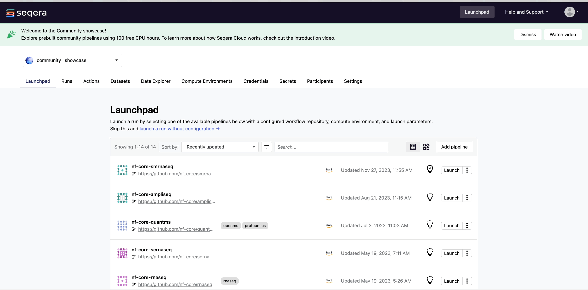

## Login 

Log in to [Seqera Cloud](https://cloud.seqera.io/login), either through a GitHub or Google account, or by providing an email address. If you are signing in for the first time, Seqera Cloud will send an authentication link to the email address, enabling you to login.

/// details | Click to show animation
    type: example

///

## Organizations and workspaces

All resources in the Seqera Platform are managed within organizations, typically named the same as your organization, such as Seqera or Johnson and Johnson. An organization can contain multiple workspaces. Each workspace is an isolated environment that can consist of different users, pipelines, credentials and compute infrastructure. Workspaces enable user access to the Platform depending on the organizational needs. Typically, teams of colleagues or collaborators will have access to one or more workspaces, and all resources in a workspace (pipelines, compute environments, datasets, etc.) are shared by members of that workspace.

With workspaces, organization owners can:

- Help research teams segment their work depending on their needs.
- Enable teams to focus on specific activities, such as core R&D or clinical trials with PII, which need to be kept secure.
- Create workspaces for specific internal departments like oncology, neuroscience, or therapeutics.
- Add organization users to workspaces as teams or groups.

Navigate to the `seqeralabs/showcase` workspace which contains all of the relevant entities required for this walkthrough guide.

/// details | Click to show animation
    type: example

///

