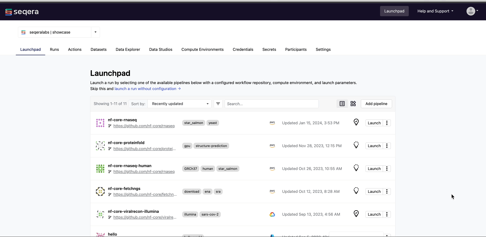
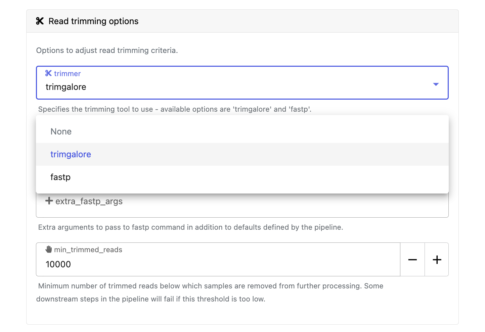

## Launchpad

Each workspace has a Launchpad that allows users to easily create and share Nextflow pipelines that can be executed on any infrastructure supported by the Platform, including all public clouds and most HPC schedulers. A Launchpad pipeline consists of a pre-configured workflow repository, compute environment, and launch parameters.

Users can create their own pipelines, share them with others on the Launchpad, or tap into over a hundred community pipelines available on nf-core and other sources.

/// details | Advanced
        type: info   
    
Adding a new pipeline is relatively simple and can be included as part of the demonstration. See [Add a Pipeline](./005_adding_a_pipeline.md).
///

## Launch the nf-core/rnaseq pipeline

### 1. Go to Launchpad

Navigate to the Launchpad in the `seqeralabs/showcase` workspace and select **Launch** next to the `nf-core-rnaseq` pipeline to open the launch form.

/// details | Click to show animation
    type: example

 
///

### 2. Nextflow parameter schema

When you select **Launch**, a parameters page is shown to allow you to fine-tune the pipeline execution. This parameters form is rendered from a file called [`nextflow_schema.json`](https://github.com/nf-core/rnaseq/blob/master/nextflow_schema.json) which can be found in the root of the pipeline Git repository. The `nextflow_schema.json` file is a simple JSON-based schema describing pipeline parameters that allows pipeline developers to easily adapt their in-house Nextflow pipelines to be executed via the interactive Seqera Platform web interface.

See the ["Best Practices for Deploying Pipelines with the Seqera Platform"](https://seqera.io/blog/best-practices-for-deploying-pipelines-with-seqera-platform/) blog for further information on how to automatically build the parameter schema for any Nextflow pipeline using tooling maintained by the nf-core community. 

### 3. Parameter selection

Adjust the following Platform-specific options if needed:

- `Workflow run name`:

    A unique identifier for the run, pre-filled with a random name. This can be customized.

- `Labels`:

    Assign new or existing labels to the run. For example, Project ID or genome version.

Each pipeline including nf-core/rnaseq will have its own set of parameters that need to be provided in order to run it. The following parameters are mandatory:

- `input`:

    Most nf-core pipelines have standardized the usage of the `input` parameter to specify an input samplesheet that contains paths to any input files (such as FastQ files) and any additional metadata required to run the pipeline. The `input` parameter can accept a file path to a samplesheet in the S3 bucket selected through Data Explorer (such as `s3://my-bucket/my-samplesheet.csv`). Alternatively, the Seqera Platform has a Datasets feature that allows you to upload structured data like samplesheets for use with Nextflow pipelines.

    For the purposes of this demonstration, select **Browse** next to the `input` parameter and search and select a pre-loaded dataset called "rnaseq_samples".

    /// details | Click to show animation
        type: example

    
    ///
    

    /// details | Advanced
        type: info    
        
    Users can upload their own samplesheets and make them available as a dataset in the 'Datasets' tab. See [Add a dataset](./006_adding_a_dataset.md).
    ///

- `outdir`:

    Most nf-core pipelines have standardized the usage of the `outdir` parameter to specify where the final results created by the pipeline are published. `outdir` must be different for each different pipeline run. Otherwise, your results will be overwritten. Since we want to publish these files to an S3 bucket, we must provide the directory path to the appropriate storage location (such as `s3://my-bucket/my-results).

    For the `outdir` parameter, specify an S3 directory path manually, or select **Browse** to specify a cloud storage directory using Data Explorer.

    /// details | Click to show animation
        type: example
    
    
    ///

Users can easily modify and specify other parameters to customize the pipeline execution through the parameters form. For example, in the **Read trimming options** section of the parameters page, change the `trimmer` to select `fastp` in the dropdown menu, instead of `trimgalore`, and select **Launch** button.

