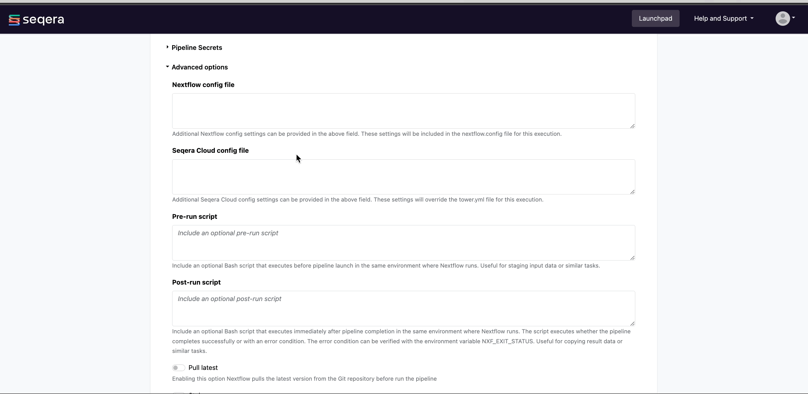

# Add a pipeline to the Launchpad

The Launchpad allows you to create a preconfigured set of Nextflow pipelines that are ready to be executed on any compute environment in a given workspace. This allows users to launch pipelines and customize the appropriate pipeline-level parameters without the need to understand the complexities of the underlying compute infrastructure.

## Adding the nf-core/rnaseq pipeline

For this walkthrough, we will add the [nf-core/rnaseq](https://github.com/nf-core/rnaseq) pipeline to the Launchpad.

Select **Add Pipeline** and specify:

- **Name**: `nf-core-rnaseq-yeast`
- **Description**: `nf-core/rnaseq pipeline configured for yeast data`
    - (*Optional*) Free text summary of the pipeline that may be useful to users when selecting a pipeline to launch. 
- **Labels**: `yeast`
    - (*Optional*) Labels allow you to categorize the pipeline according to arbitrary criteria (such as reference genome version) that may help users to select the appropriate pipeline for their analysis from the Launchpad.
- **Compute environment**: `seqera_aws_ireland_fusionv2_nvme`
    - Select an existing workspace compute environment. In this case, it is an AWS Batch compute environment in Ireland that has been pre-configured to use Fusion version 2.
- **Pipeline to launch**: `https://github.com/nf-core/rnaseq`
    - Platform allows you to select any public or private Git repository that contains Nextflow source code.
- **Revision number**: `3.14.0`
    - When you provide the **Pipeline to launch**, Platform will search all of the available tags and branches in the upstream pipeline repository and render a dropdown to select the appropriate version. Selecting a specific version is very important for reproducibility to ensure each run generates the same results.
- **Config profiles**: `test`
    - (*Optional*) Platform allows you to select a profile that has been defined in the Nextflow pipeline. All nf-core pipelines have a `test` profile that is associated with a minimal test dataset. This profile runs the pipeline with heavily sub-sampled input data for the purposes of [CI/CD](https://resources.github.com/devops/ci-cd/) and to quickly confirm that the pipeline runs on any given infrastructure. The `test` profile of the nf-core/rnaseq pipeline was created using yeast data, which is why we add that particular annotation in the **Labels** section.
- **Pipeline parameters**:
    - (*Optional*) You can set any custom pipeline parameters in this section that will be prepopulated when users launch the pipeline from the Launchpad. For example, set the path to local reference genomes so users don't have to worry about locating these files when launching the pipeline.
- **Pre-run script**:
    - (*Optional*) You can define Bash code that executes before the pipeline launches in the same environment where Nextflow runs. Pre-run scripts are useful for defining executor settings, troubleshooting, and defining a specific version of Nextflow with the `NXF_VER` environment variable.

Once you have populated the appropriate settings, select **Add** and this pipeline will become available for other users in the same workspace to launch within the preconfigured compute infrastructure.

