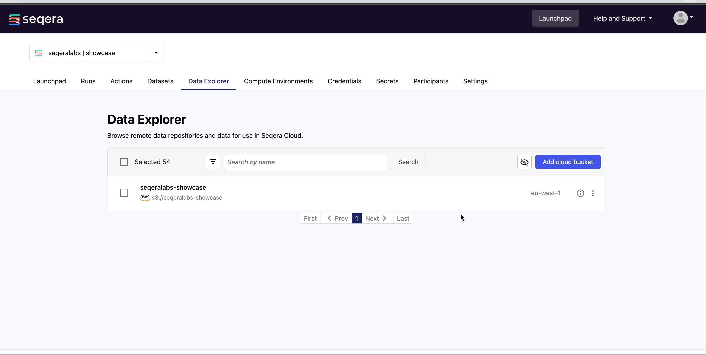
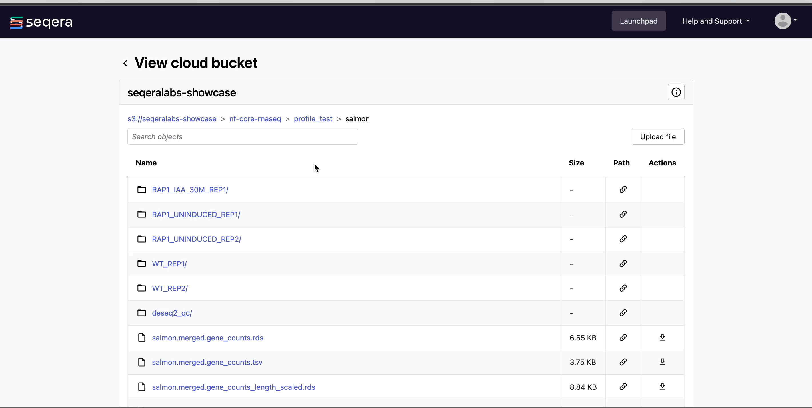

# Data Explorer

When running pipelines in the Cloud, users typically need access to buckets and blob storage to view pipeline results and upload files (such as samplesheets and reference data) for analysis. Managing credentials and permissions for multiple users, as well as training users to navigate Cloud consoles and CLIs, can be complicated. Instead, users can view their data directly through Data Explorer.

With Data Explorer, you can browse and interact with remote data repositories from organization workspaces in Seqera Platform. It supports AWS S3, Azure Blob Storage, and Google Cloud Storage repositories.

## View pipeline outputs in Data Explorer

In Data Explorer, you can:

  - **View bucket details**:
    View the cloud provider, bucket address, and credentials by selecting the information icon next to a bucket in the Data Explorer list.

    /// details | Click to show animation
        type: example

    
    ///

  - **View bucket contents**
    Select a bucket name from the Data Explorer list to view the contents of that bucket. 
    
    The file type, size, and path of objects are displayed in columns to the right of the object name. For example, we can take a look at the outputs of our nf-core/rnaseq run.

    /// details | Click to show animation
        type: example
    
    
    ///

   - **Preview files**: 
    Select a file to open a preview window that includes a **Download** button. For example, we can use Data Explorer to view the results of the nf-core/rnaseq pipeline that we executed. Specifically, we can view the resultant gene counts of the salmon quantification step:

    /// details | Click to show animation
        type: example

    
    ///

## Configure a bucket to browser in Data Explorer
Data Explorer also enables you to add public cloud storage buckets to view and use data from resources such as:

- [The Cancer Genome Atlas (TCGA)](https://registry.opendata.aws/tcga/)
- [1000 Genomes Project](https://registry.opendata.aws/1000-genomes/)
- [NCBI SRA](https://registry.opendata.aws/ncbi-sra/)
- [Genome in a Bottle Consortium](https://docs.opendata.aws/giab/readme.html)
- [MSSNG Database](https://cloud.google.com/life-sciences/docs/resources/public-datasets/mssng)
- [Genome Aggregation Database (gnomAD)](https://cloud.google.com/life-sciences/docs/resources/public-datasets/gnomad) 

## Add a cloud bucket
Select **Add cloud bucket** from the Data Explorer tab to add individual buckets (or directory paths within buckets). 

## Fill in bucket details
Specify the Provider, Bucket path, Name, Credentials, and Description, then select **Add**. For public cloud buckets, select Public from the Credentials dropdown menu.

  /// details | Click to show animation
      type: example

  
  ///

You can now use this data in your analysis without having to interact with Cloud consoles or CLI tools. 
