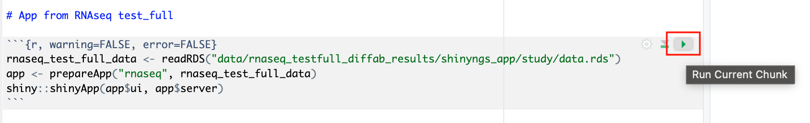
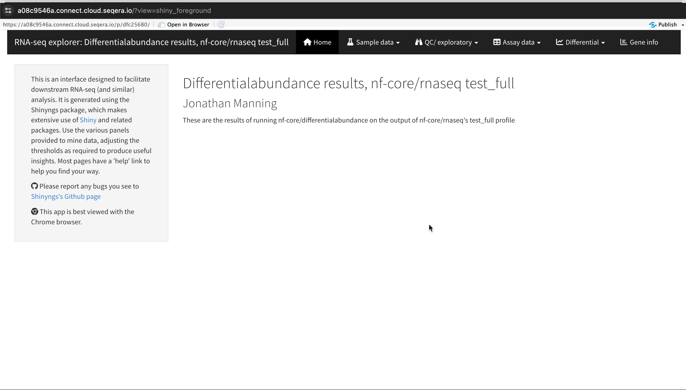

## Introduction to Data Studios
After running a pipeline, you may want to perform tertiary analysis using platforms like Jupyter Notebook or RStudio. Setting up the infrastructure for these platforms, including accessing pipeline data, results, and necessary bioinformatics packages, can be complex and time-consuming.

Data Studios streamlines this process for Seqera Platform users by allowing them to add interactive analysis environments based on templates, similar to how they add and share Pipelines and Datasets.

The Seqera Platform manages all the details, enabling users to easily select their preferred interactive tool and analyze their data within the platform.

On the 'Data Studios' tab, you will be able to monitor and see the details of Studios in a Workspace.

Studios will have a name, followed by the cloud provider they are run on, the container image being used (Jupyter, VS Code, RStudio), the user who created the Studio, the timestamp for creation, followed by the status to indicate whether it has Started, Stopped, or is Running. 

Clicking on the three dots will allow you to:
- See the details of the Studio
- Connect to the Studio
- Start the studio
- Stop the studio
- Copy the Data Studio URL

## Analyse RNAseq Data in Data Studios

We can use Data Studios to perform bespoke analysis on the results of upstream workflows. For example we can run the nf-core/rnaseq workflow to quantify gene expression, followed by nf-core/differentialabundance to derive differential expression statistics, and then use Data Studios to interrogate and visualise the results of those analyses. 

As an example, we have run RNAseq results through the differentialabundance pipeline and created a new Data Studio with these results from the cloud mounted into the Studio to perform further analysis. One of these outputs is a Shiny application, which we can deploy for interactive analysis.

/// details | Presenter's Note
        type: note   

The Data Studios demonstration involves deploying a RShiny app to explore RNAseq results. This will open the app in a new browser window. You may choose to have this window already open before your demo and switch over to it.
///

### 1. Open the RNAseq Analysis Studio 
Click on the __rnaseq_to_differentialabundance__ Studio.

Upon clicking on the Studio, you will see we are able to create an RStudio environment that uses an existing Compute Environment available in this Workspace. 

We have also mounted data generated from our RNAseq pipeline and subsequent differentialabundance pipeline, directly from AWS S3. 

We can also specify the resources this Studio will use. 

/// details | Click to show animation
    type: example

///

### 2. Connect to the Studio
This Data Studio will start an RStudio environment in which we have already installed the necessary R packages for deploying an RShiny app that will allow us to interact with various comparisons and visualisations of our RNAseq data. We've also generated an R Markdown document with the commands in place to generate the R Shiny application.

/// details | Click to show animation
    type: example

///

We can deploy the RShiny app in the Data Studio by clicking on the green play button on the last "chunk" or section of the R script:

### 3. Explore results in RShiny app
In a separate browser window, the RShiny app will deploy to provide an interface where you can interact with the data.

You will be able to see information about your sample data, perform QC/exploratory analysis, and take a look at results of differential expression analyses.

/// details | Click to show animation
    type: example

///

#### Exploring Sample Clustering with PCA
Under the 'QC/Exploratory' tab, you can click on the PCA (Principal Component Analysis) plot to visualize how the samples group together based on their gene expression profiles.

In this example, we used RNA-seq data from the publicly available ENCODE project, which includes samples from four different cell lines: GM12878 (a lymphoblastoid cell line), K562 (a chronic myelogenous leukemia cell line), MCF-7 (a breast cancer cell line), and H1-hESC (human embryonic stem cells).

Here’s what to look for in the PCA plot:

- **Replicate Clustering**: Ideally, replicates of the same cell type should cluster closely together. For example, you should see the replicates of MCF-7 (breast cancer cell line) grouping together. This indicates consistent gene expression profiles among replicates.

- **Cell Type Separation**: Different cell types should form distinct clusters. For instance, GM12878, K562, MCF-7, and H1-hESC samples should each form their own separate clusters, reflecting their unique gene expression patterns.

Using this PCA plot, you can gain insights into the consistency and quality of your RNA-seq data, identify any potential issues, and understand the major sources of variation among your samples - directly in the Platform.

/// details | Click to show animation
    type: example

///

#### Exploring Gene Expression Changes with Volcano Plots 
Under the 'Differential' tab, you can click on 'Volcano plots' to compare genes with significant changes in expression between two samples. For example, you can filter for 'Type: H1 vs MCF-7' to view the differences in expression between these two cell lines.

1. **Identifying Upregulated and Downregulated Genes**: The x-axis of the volcano plot represents the log2 fold change in gene expression between the H1 and MCF-7 samples, while the y-axis represents the statistical significance of the changes.

    - **Upregulated Genes in MCF-7**: Genes on the left side of the plot (negative fold change) are upregulated in the MCF-7 samples compared to H1. For example, you may notice the SHH gene, which is known to be upregulated in cancer cell lines, prominently appearing here.

2. **Filtering for Specific Genes**: If you are interested in specific genes, you can use the filter function. For example, you can filter for the SHH gene in the table below the plot. This will allow you to quickly locate and examine this gene in more detail.

3. **Gene Expression Bar Plot**: After filtering for the SHH gene, click on it to navigate to a gene expression bar plot. This plot will show you the expression levels of SHH across all samples, allowing you to see in which samples it is most highly expressed.

    - In this case, you will see that SHH is most highly expressed in MCF-7, which aligns with its known role in cancer cell proliferation.

Using the volcano plot, you can effectively identify and explore the genes with the most significant and meaningful changes in expression between your samples, providing a deeper understanding of the molecular differences.

/// details | Click to show animation
    type: example

///

### 4. Collaborate in the Studio
If you wanted to share the results of your RNAseq analysis or allow colleagues to perform exploratory analysis as we just did, you can share a link to the Data Studio by selecting the three dots next to the status message for the data studio you want to share, then select **Copy data studio URL**. Using this link other authenticated users with the "Connect" role at minimum, can access the session directly.

### 5. Takeaway
This example demonstrates how Data Studios allows you to perform interactive analysis and explore the results of your secondary data analysis all within one unified platform. It simplifies the setup and data management process, making it easier for you to gain insights from your data efficiently.
