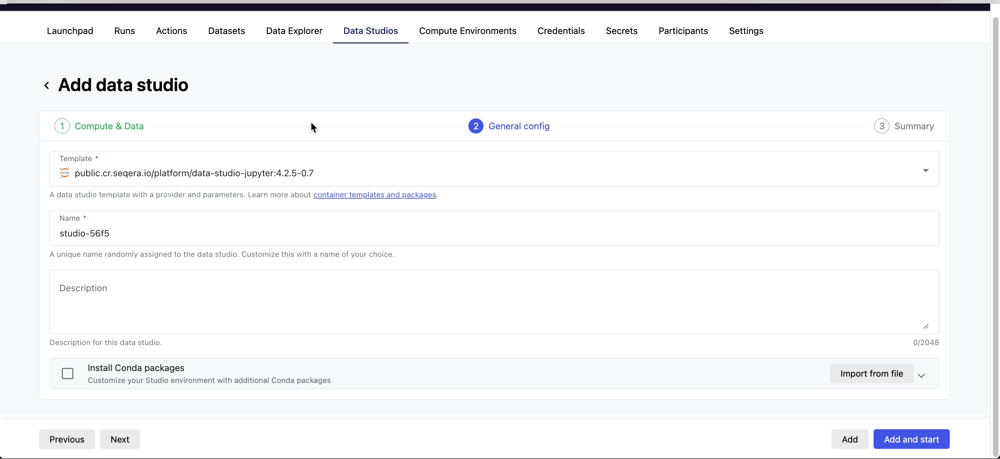
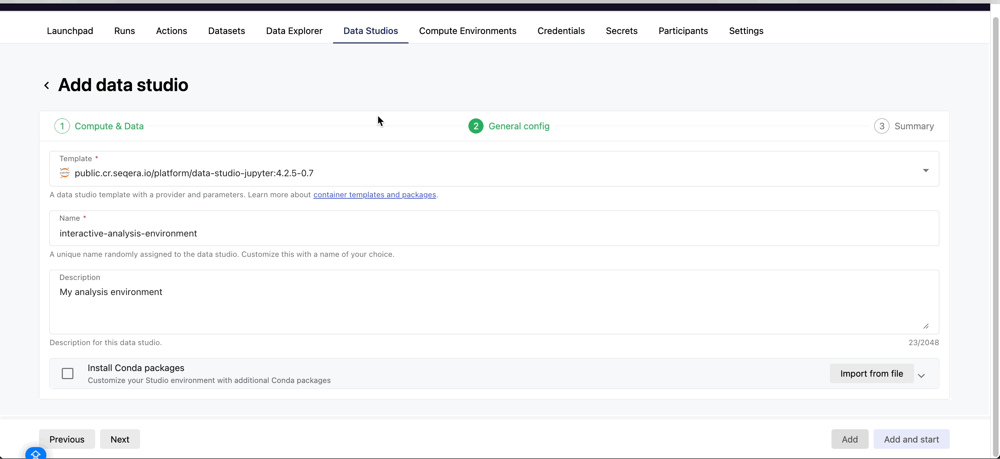
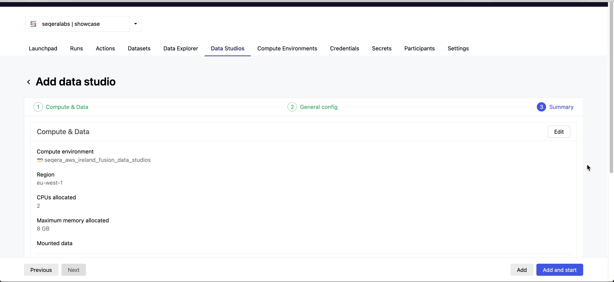
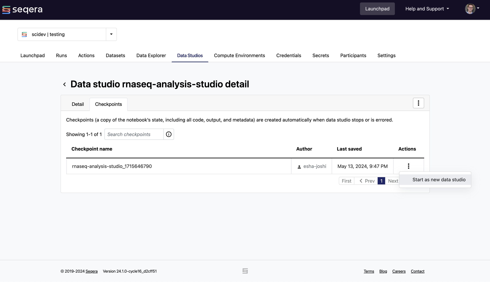

## Data Studio setup

### Create a data studio

In a workspace, select Data Studios, and then select **Add data studio**.

#### 1. Compute & Data {#hidden-heading}

Customize the following fields:

For Compute:

- 1\. Select an available AWS Batch compute environment
- 2\. **CPUs allocated**: Select the number of CPUs to allocate to the data studio
- 3\. **GPUs allocated**: Available only if the selected compute environment has GPU support enabled
- 4\. **Maximum memory allocated**: Select the maximum memory to allocate

For Data:

- To mount data, select **Mount data** and choose the data to mount from the Data Explorer modal. Confirm your selection by clicking **Mount data**. The mounted data will be accessible at `/workspace/data/<dataset>` via the Fusion file system. Note that the mounted data does not need to be in the same compute environment or region as the data studio's cloud provider. However, this may lead to increased costs or errors.
- Click the **Next** button to proceed to the next section.

/// details | Click to show animation
        type: example


///

#### 2. General config {#hidden-heading}

For the General config section, you can specify details about your data studio environment. You can:

- Use a pre-built container template provided by Seqera
- Use a pre-built container template provided by Seqera and install Conda packages
- Use a custom container template image that you supply

To use one of the Seqera-provided container templates, complete the following steps:

- 1\. Container template: Select a data studio template from the dropdown list.
- 2\. Data studio name
- 3\. Optional: Description
- 4\. Optional: Select **Install Conda packages** to enter or upload a list of Conda packages
  For example:

```
name: myenv
channels:
  - conda-forge
dependencies:
  - python=3.10
  - numpy
```

- 5. Select **Next**.

/// details | Click to show animation
    type: example


///

To use a custom container template image that you supply, complete the following steps:

- 1\. Container template: Select **Prebuild container image** from the list. This should be a Docker image stored in public registry or AWS private/public ECR. For information about providing your own template, see [Custom container template image](https://docs.seqera.io/platform/24.2/data_studios#custom-container-template-image) on how to provide your own image with the dependencies you need for your data studio.
- 2\. Data studio name
- 3\. Optional: Description

If you select the Prebuild container image template, you cannot select Install Conda packages as these options are mutually exclusive.

/// details | Click to show animation
    type: example


///

#### 3. Summary {#hidden-heading}

The last step will bring you to a summary page where you can review your configuration and save the data studio. Once you have ensured that the specified configuration is correct, you can:

- Save your configuration: If you want to save the data studio for future use, select **Add only**.
- Save and immediately start the data studio: If you want to save and immediately start the data studio, select **Add and start**.

After setup, you'll be directed to the Data Studios landing page, where you can view and manage your data studio sessions. The status of your newly created data studio will be displayed as either "stopped" or "starting", depending on whether you chose to add it or start a session immediately.

/// details | Click to show animation
    type: example


///

### Connect to a data studio

Once you have created a data studio, you can connect to it by selecting the three dots next to the status message and choosing **Connect**. A new browser tab will open, displaying the status of the data studio session. Select **Connect**.

### Collaborate in a data studio

Collaborators can also join a data studios session in your workspace. For example, to share the results of the nf-core/rnaseq pipeline, you can share a link by selecting the three dots next to the status message for the data studio you want to share, then select **Copy data studio URL**. Using this link, other authenticated users with the "Connect" role (at minimum) can access the session directly.

<div style="clear: both;"></div>

{ .right .image}

### Stop a data studio

To stop a running session, select the three dots next to the status and select **Stop**. Any unsaved analyses or results will be lost.<br>

<div style="clear: both;"></div>

<br>

/// details | Advanced
    type: info

For a more detailed use case of performing interactive analysis with the results of the nf-core/rnaseq pipeline in an RStudio/RShiny app environment, take see [Interactive analysis with Data Studios](./011_interactive_analysis_data_studios.md).
///

### Checkpoints in Data Studios

Data Studios automatically saves changes to the root filesystem every five minutes in the compute environment's `.studios/checkpoints` folder. These checkpoints are valuable for long-term projects or complex environments, ensuring that setup isn't lost between sessions. They can be shared with colleagues, saving them setup time.

Checkpoints preserve packages and configurations but not mounted data changes. You can restore from a previous checkpoint when starting a new session. Checkpoints can be renamed and are automatically cleaned up when their data studios are deleted. To return to a previous configuration, restart the session from a checkpoint as shown below:



## More information

For a detailed explanation about specific concepts of Data Studios and the tools preinstalled in Seqera-provided Data Studios images and help on creating your own custom images for Studios, see the [Seqera Platform docs](https://docs.seqera.io/platform/24.2/data_studios).

/// details | Advanced
    type: info

For additional details on Data Studios based on a demonstration from Rob Newman, see [Data Studios deep dive](./014_data_studios_deep_dive.md).  
///
