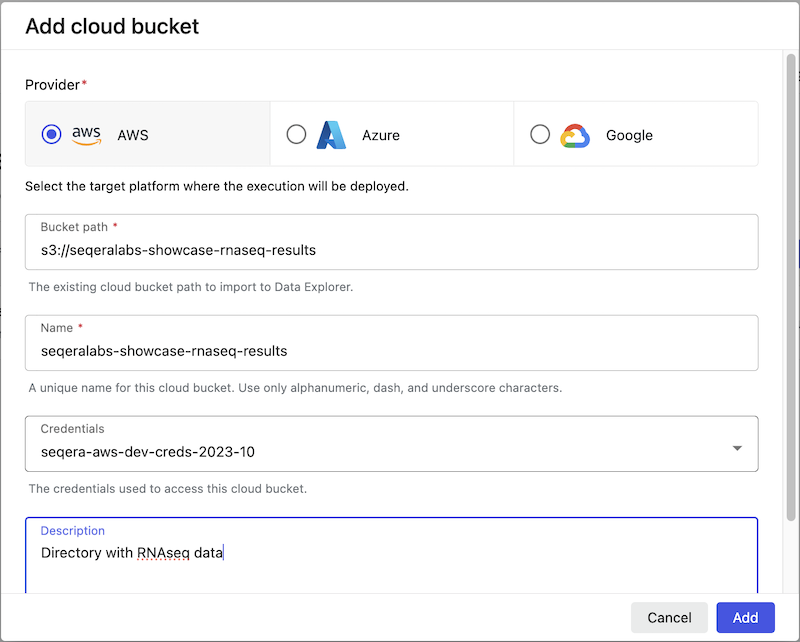

## Data Studio Setup

### Create a Data Studio

#### 1. Add a Data Studio {#hidden-heading}

To create a Data Studio, click on the 'Add data studio' button and select from any one of the three currently available templates.

/// details | Click to show animation
    type: example

///

#### 2. Select a compute environment {#hidden-heading}

Currently, only AWS Batch is supported.

#### 3. Mount data using Data Explorer {#hidden-heading}
##### Create a Data Link
To enable access to data in a Studio, we can create a custom data link pointing to the directory in our AWS S3 bucket where the results are saved. This will allow us to read and write on only the data we need from Cloud Storage, within our Studio.

This can be achieved by using the 'Add cloud bucket' button in Data Explorer and specifying the path to our output directory:

{ .center }

##### Mount the Data Link into the Studio
Select data to mount into your data studios environment using the Fusion file system in Data Explorer. In the Data Explorer, you can select for the newly created Data Link to mount.

This data will be available at `/workspace/data/<dataset>`.

/// details | Click to show animation
    type: example

///

#### 4. Resources for environment {#hidden-heading}

Enter a CPU or memory allocation for your data studios environment (optional). The default is 2 CPUs and 8192 MB of memory.

Then, click Add!

The data studio environment will be available in the Data Studios landing page with the status 'stopped'. Click on the three dots and **Start** to begin running the studio.

/// details | Click to show animation
    type: example

///

{ .right .image}

### Connect to a Data Studio

To connect to a running data studio session, select the three dots next to the status message and choose **Connect**. A new browser tab will open, displaying the status of the data studio session. Select **Connect**.
 

### Collaborate in Data Studio

Collaborators can also join a data studios session in your workspace. For example, to share the results of the nf-core/rnaseq pipeline, you can share a link by selecting the three dots next to the status message for the data studio you want to share, then select **Copy data studio URL**. Using this link other authenticated users with the "Connect" role at minimum, can access the session directly.

{ .right .image}
### Stop a Data Studio

To stop a running session, click on the three dots next to the status and select **Stop**. Any unsaved analyses or results will be lost. 

 

/// details | Advanced
    type: info    

For a more detailed use-case of performing tertiary analysis with the results of the nf-core/rnaseq pipeline in an RStudio/RShiny app environment, take a look at the [Tertiary analysis with Data Studios](./011_tertiary_analysis_data_studios.md) section.
///

## Checkpoints in Data studios

When starting a data studio, a checkpoint gets created. This checkpoint allows you to restart a data studio with previously installed software and changes made to the root filesystem of the container. Please note, that if you stop a data studio and restart it, this will restart it from the latest checkpoint. To go back to a specific previous configuration of data studio session, please restart it from a checkpoint as highlighted in the screenshot below:

## More information

If you want more detailed explanation about specific concepts of Data Studios or find out which tools are preinstalled in Data Studio images, please visit [Seqera Platform Docs](https://docs.seqera.io/platform/23.4.0/data/data-studios)

/// details | Advanced
    type: info    

To see additional details on Data Studios based on a demonstration from Rob Newman, please visit [this hidden section](./013_data_studios_deep_dive.md).  
///
