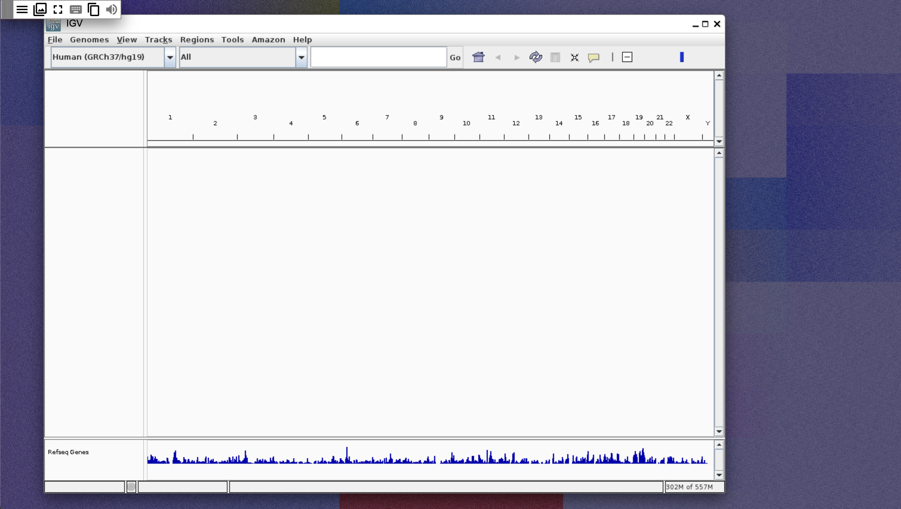

## Analysing genomic data using IGV desktop in Data Studios

We can use the Xpra data studio image to visualize genetic variants using IGV desktop. The stock Xpra image does not come with IGV preinstalled, so we will need to install it and then use IGV to visualize a variant in the 1000 Genomes Project.

### 1. Open the Xpra data studio
Select the existing **xpra-demo** data studio.

When you click on "Start" you will see that the data studio is mounting the `xpra-1000G` bucket. This is the 1000 Genomes public bucket `
s3://1000genomes`, but we have created a second data link inside the workspace to not block or collide with the data link titled `1000 genomes`.

### 2. Upload IGV install script and copy to `/workspace`
To make it easier to get IGV and it's requirements installed efficiently, we created a small script that will download the IGV prebuild binaries for Linux and install them inside the data studio. To use the install script, upload `download_and_install_igv.sh` by clicking the top left navbar, select Server -> Upload file. This will upload the file to `/root`. Let's copy it to `/workspace` with the `cp` command: `cp /root/download_and_install_igv.sh /workspace`.

### 3. Install IGV
Run the script with `bash`: `bash /workspace/download_and_install_igv.sh`. This will download and install IGV desktop and open it. You should see the IGV desktop window open if everything worked correctly.

### 4. View 1000 Genomes Project data in IGV
Inside IGV desktop, change the genome version to hg19. Then click on File -> Load from File and select the following file as shown in the screenshot.
`/workspace/data/xpra-1000Genomes/phase3/data/HG00096/high_coverage_alignment`.

Search for PCSK9 and zoom into one of the exons of the gene. If you are on genome version hg19 and everything worked as expected, you should be able to see a coverage graph and reads as shown in the screenshot below:

