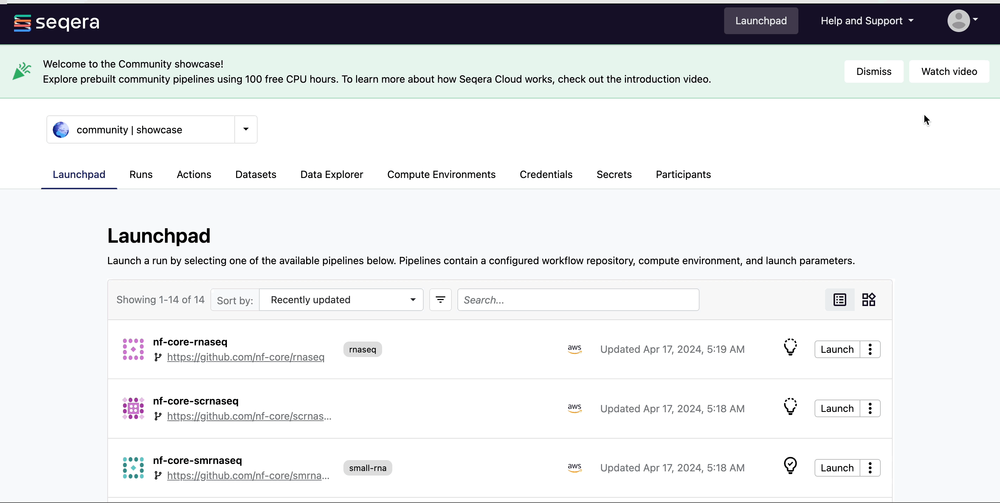

Seqera Platform provides multiple methods of programmatic interaction allowing you to automate the execution of pipelines, chain pipelines together, and integrate the Platform into third-party services of your choosing.

### 1. Seqera Platform API

The Seqera Platform public API is the lowest-level method of programmatic interaction. All operations available in the user interface can be achieved through the API. 

The API can be used to trigger the launch of pipelines based on a file event (such as the upload of a file to a bucket) or completion of a previous run.

The API can be accessed from `https://api.cloud.seqera.io`.

The full list of endpoints is available in Seqera's OpenAPI schema found [here](https://cloud.seqera.io/openapi/index.html). The API requires an authentication token to be specified in every API request. This can be created in your user menu under **Your tokens**.

/// details | Click to show animation
    type: example

///

The token is only displayed once. Store your token in a secure place. Use this token to authenticate requests to the API.

/// details | Advanced
        type: info    

For an example of how to use the API to launch a pipeline, we can make the following request using cURL: 

    
    curl -X POST "https://api.cloud.seqera.io/workflow/launch?workspaceId=38659136604200" \
        -H "Accept: application/json" \
        -H "Authorization: Bearer <your_access_token>" \
        -H "Content-Type: application/json" \
        -H "Accept-Version:1" \
        -d '{
        "launch": {
            "computeEnvId": "hjE97A8TvD9PklUb0hwEJ",
            "runName": "first-time-pipeline-api-byname",
            "pipeline": "first-time-pipeline",
            "workDir": "s3://nf-ireland",
            "revision": "master"
        }
    }'
    
///

### 2. Seqera Platform CLI

For bioinformaticians and scientists more comfortable with the CLI, Seqera Platform also comes with a command line utility called `tw` to manage resources. 

The CLI provides an interface to launch pipelines, manage compute environments, retrieve run metadata, and monitor runs on Platform. It provides a Nextflow-like experience for bioinformaticians who prefer the CLI and allows you store Seqera resource configuration (pipelines, compute environments, etc.) as code. The CLI is built on top of the [Seqera Platform API](#1-seqera-platform-api) but is simpler to use. For example, you can refer to resources by name instead of their unique identifier.

See the [CLI GitHub repository](https://github.com/seqeralabs/tower-cli/) for installation and usage details.

/// details | Advanced
    type: info    

For example, to launch the hello pipeline using the CLI:

    tw launch hello --workspace seqeralabs/showcase
///

### 3. seqerakit

`seqerakit` is a Python wrapper for the Seqera Platform CLI which can be leveraged to automate the creation of all of the entities in Seqera Platform via a YAML format configuration file. It can be used to automate the creation of entities, from organizations and workspaces to pipelines and compute environments, and the execution of workflows in one YAML.

The key features are:

- **Simple configuration**: All of the command-line options available in the Seqera Platform CLI can be defined in simple YAML format.
- **Infrastructure as Code**: Enable users to manage and provision their infrastructure specifications.
- **Automation**: End-to-end creation of entities within Seqera Platform, from adding an organization to launching pipeline(s) within that organization.

See the [seqerakit GitHub repository](https://github.com/seqeralabs/seqera-kit/) for installation and usage details.

/// details | Advanced
    type: info    

For example, to launch the hello pipeline using seqerakit, you can create a YAML file called `hello.yaml` as follows:

    launch:
    - name: "hello-world"
        url: "https://github.com/nextflow-io/hello"
        workspace: "seqeralabs/showcase"

Then run seqerakit with:

    $ seqerakit hello.yaml

///

## Resources
Common use cases for the automation methods above include automatically executing a pipeline as data arrives from a sequencer, or integrating Seqera Platform into a broader customer facing application. For a step-by-step guide to set up these automation methods, see [Workflow automation for Nextflow pipelines](https://seqera.io/blog/workflow-automation/).

For examples on how to use automation to chain workflows together, see [Automating pipeline execution with Nextflow and Tower](https://seqera.io/blog/automating-workflows-with-nextflow-and-tower/).