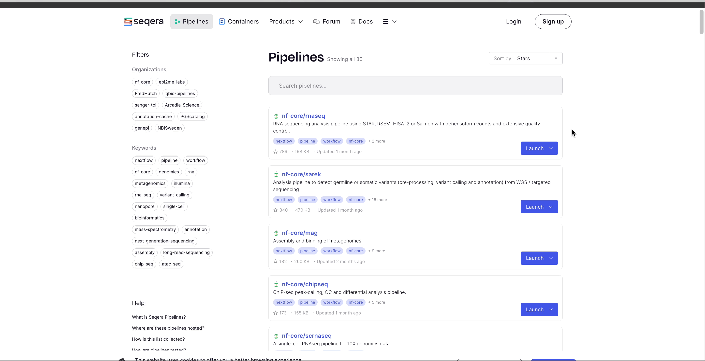
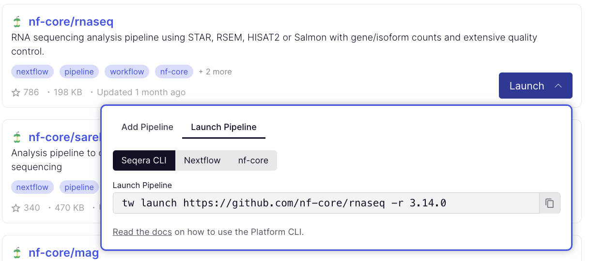

# Seqera Pipelines

Seqera Pipelines is a list of the best, open-source Nextflow workflows. Finding high-quality pipelines is critical, so we’ve created a tightly curated list of the very best workflows to begin with.

Every pipeline comes with curated test data, so you can import into Seqera Platform and launch a test run in just a few clicks:

/// details | Click to show animation
    type: example

///

The pipeline details page provides key information about the workflow. Within one-click, you can add pipelines to your launchpad within Seqera Platform.

Simply click the 'Launch' button, specify whether you would like to add the pipeline to a Cloud or Enterprise instance, and provide your user access token for the Platform.

You can then select for the Orgaization, Workspace, and Compute Environment for the pipeline. 

/// details | Click to show animation
    type: example

///

Click on the 'Launch Pipeline' tab to see various methods for launching the pipeline.

If you’re more at home in the terminal, you can use the launch box to grab commands for Nextflow, [Seqera Platform CLI](014_automation_on_the_seqera_platform.md), and [nf-core/tools](https://nf-co.re/docs/nf-core-tools).
