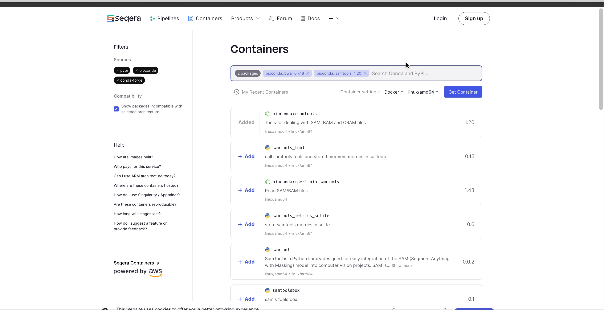

# Seqera Containers

Containers have revolutionized research by providing portable environments that eliminate compatibility issues across different computing environments.

Nextflow supports Docker containers but pipeline developers often face challenges in having to write Dockerfile scripts for each workflow step.

Projects like BioContainers offer pre-built images for Bioconda tools but have limitations. Wave, our open-source on-demand container provisioning service, simplifies this process by allowing Nextflow developers to reference conda packages or a bundled Dockerfile, building containers on the fly.

Seqera Containers enhance the Wave experience by allowing users to type in the names of desired tools and instantly receive a container URI, usable for any purpose. The image is stored in a cache provided by AWS, ensuring reproducibility and availability for future runs without expiry.

Users can:

1. Request any combination of packages

    /// details | Click to show animation
        type: example

    
    ///

2. Select architecture and image format (i.e. linux/arm64 architecture)

    /// details | Click to show animation
        type: example

    
    ///

3. Users can create Singularity images and download `.sif` files directly

    /// details | Click to show animation
        type: example

    
    ///

You can view containers you previously build using the 'My Recent Containers' button. 

Clicking 'View build details' for the container shows the full information of the Dockerfile, conda environment file, and build settings, as well as the complete build logs. Every container includes results from a security scan.

/// details | Click to show animation
    type: example

///