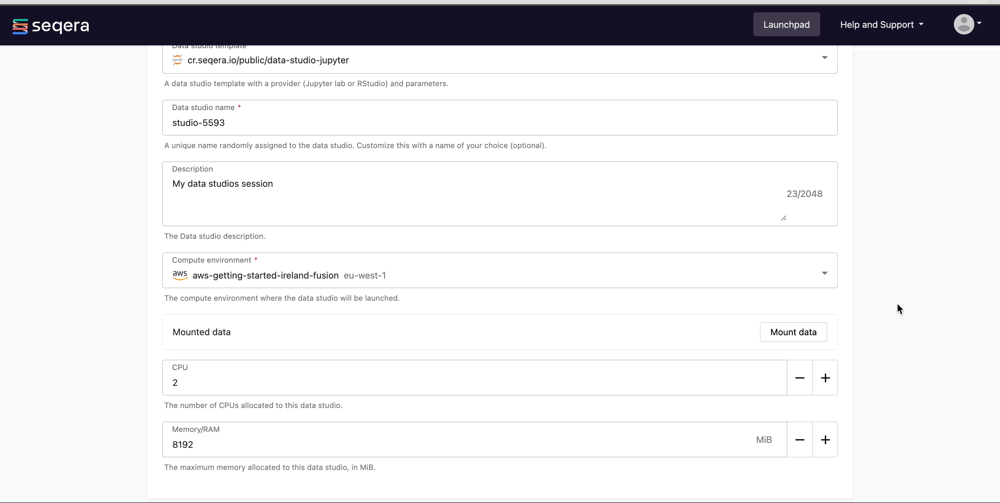
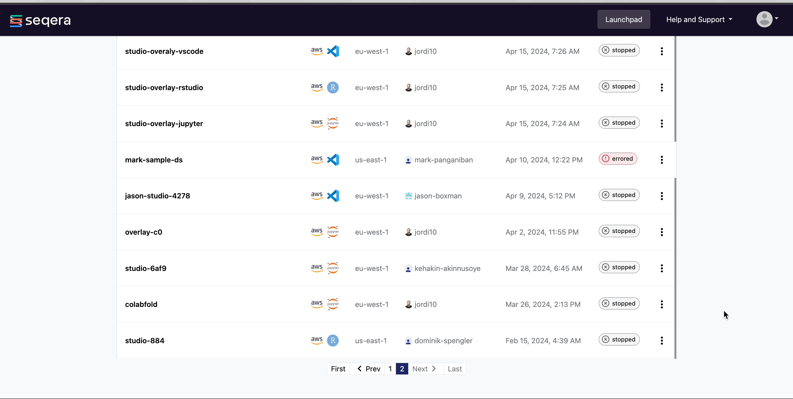
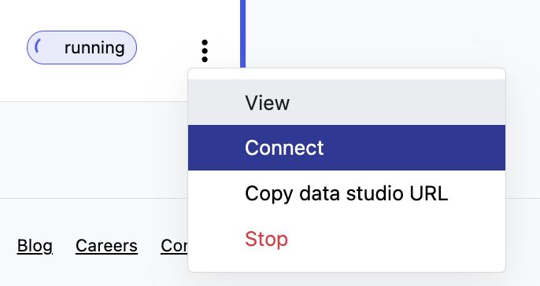
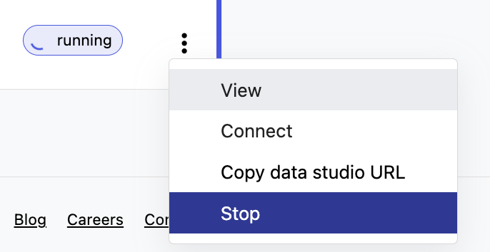

Data Studios is a unified platform where you can perform analysis of your pipeline results after successful execution. It allows you to host a combination of images and compute environments for interactive analysis using your preferred tools, like Jupyter notebooks, RStudio, and Visual Studio Code IDEs. Each data studio session is an individual interactive environment that encapsulates the live environment for dynamic data analysis.

<!--
TODO: update gifs with showcase data studios eventually
TODO: add custom datalink for outdir from nf-core/rnaseq results to mount here
TODO: show example of using jupyter or rstudio with nf-core/rnaseq results
 -->

### Create a Data Studio

#### 1. Create a Data Studio

To create a Data Studio, click on the 'Add data studio' button and select from any one of the three currently available templates.

#### 2. Select a compute environment

Currently, only AWS Batch is supported.

#### 3. Mount data using Data Explorer

Select data to mount into your data studios environment using the Fusion file system in Data Explorer. This data will be available at `/workspace/data/<dataset>`.

For example, to take a look at the results of your nf-core/rnaseq pipeline run, you can mount the value of the `outdir` parameter specified in the [earlier step when launching the pipeline](./launch_pipeline.md).

#### 4. Resources for environment

Enter a CPU or memory allocation for your data studios environment (optional). The default is 2 CPUs and 8192 MB of memory.

Then, click Add!

The data studio environment will be available in the Data Studios landing page with the status 'stopped'. Click on the three dots and **Start** to begin running the studio.

{ .right .image}

### Connect to a Data Studio

To connect to a running data studio session, select the three dots next to the status message and choose **Connect**. A new browser tab will open, displaying the status of the data studio session. Select **Connect**.
 

### Collaborate in Data Studio

Collaborators can also join a data studios session in your workspace. For example, to share the results of the nf-core/rnaseq pipeline, you can share a link by selecting the three dots next to the status message for the data studio you want to share, then select **Copy data studio URL**. Using this link other authenticated users can access the session directly.

{ .right .image}

### Stop a Data Studio

To stop a running session, click on the three dots next to the status and select **Stop**. Any unsaved analyses or results will be lost.
