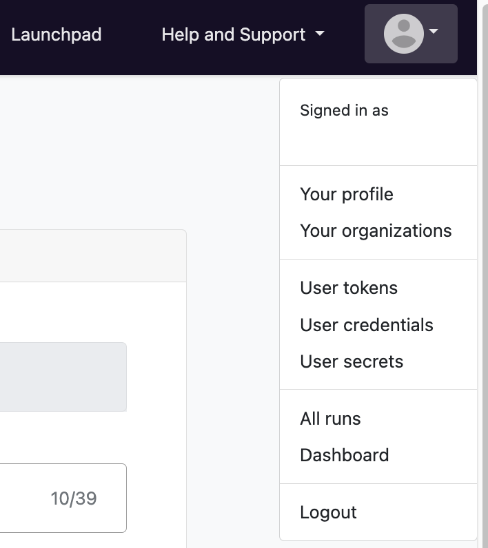

### 1. Login to seqera.io

Log into Seqera Platform, either through a GitHub account, Google account, or an email address.

If an email address is provided, Seqera Cloud will send an authentication link to the email address to login with.

### 2. Navigate into the seqeralabs/showcase Workspace

All resources in Seqera Platform live inside a Workspace, which in turn belong to an Organisation. Typically, teams of colleagues or collaborators will share one or more workspaces. All resources in a Workspace (i.e. pipelines, compute environments, datasets) are shared by members of that workspace.

Navigate into the `seqeralabs/showcase` Workspace.

### 3. User settings

To access or modify your user settings such as your username, or name, click on the avatar icon in the top right corner. You will be able to modify these settings in 'Your profile'.

{ .right .image}

You can specify user specific settings such as:

- **User tokens**: Your personal access token for authentication on the Platform, used in [automation](./automation.md).
- **User credentials**: Credentials for your own personal workspace which can include cloud access keys, repository credentials, Docker credentials.
- **User secrets**: Secrets used in any Nextflow workflows launched in your user workspace.
