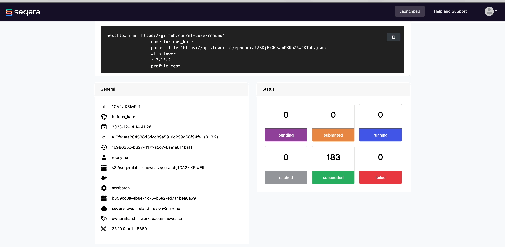
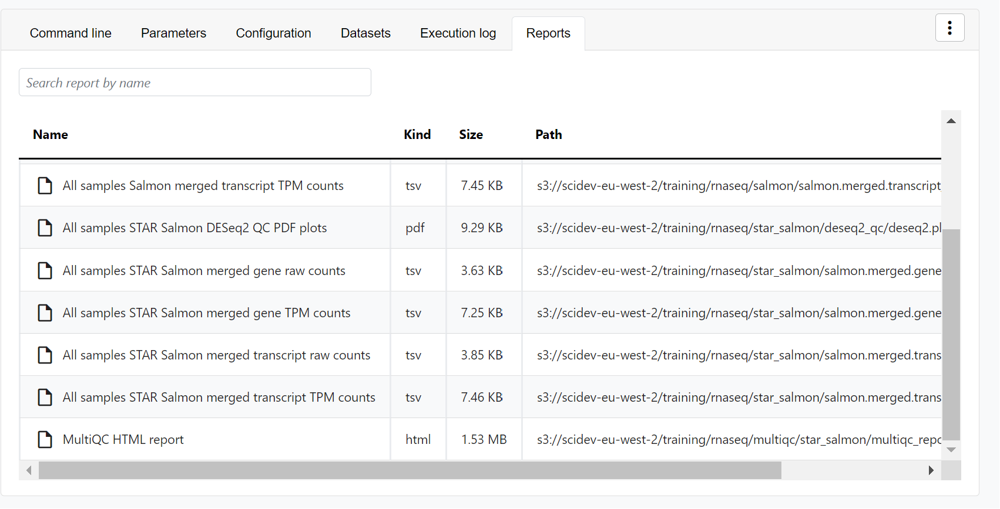

# View the Runs

Upon launching, you'll be navigated to the 'Runs' tab which contains all executed workflows. Click on the workflow executed in the previous step.

The Runs tab contains all previous job executions. Each new or resumed job is given a random name, e.g., "grave_williams". Each row corresponds to a specific job. As a job executes, it can transition through the following states:

- **submitted**: Pending execution
- **running**: Running
- **succeeded**: Completed successfully
- **failed**: Successfully executed, where at least one task failed with a terminate error strategy
- **cancelled**: Stopped forceably during execution
  unknown: Indeterminate status

As the pipeline begins to run, you will see the Runs page become populated with the following details:

- Command-line invocation for the Run
- Parameters specified to the pipeline
- Resolved Nextflow configuration
- Execution Log
- Datasets used, and Reports generated

## 1. View Run info

On the Runs page will be General information about who executed the run, when, the Git hash used and tag, as well as additional details about the compute environment used, and the version of Nextflow.

## 2. View Reports

Most Nextflow pipelines will generate reports or output files which are useful to inspect at the end of the pipeline execution. Reports can contain quality control (QC) metrics that would be important to assess the integrity of the results.

Reports allow you to directly visualise supported file types or to download them via the user interface. This saves users the time and effort of having to retrieve and visualize output files from their local storage. Once the pipeline completes, you can view the outputs of the pipeline in the 'Reports' tab.

For example, for the nf-core/rnaseq pipeline, you can view the MultiQC report generated.

